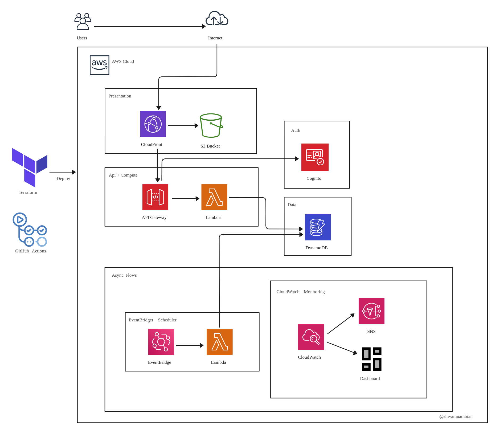

# Incident Tracker
<p align="center">A fully serverless incident tracker built on AWS. Demonstrates end-to-end ownership of cloud architecture, IaC, CI/CD, and security-conscious design.</p>

<p align="center">
  <a href="#what-this-demonstrates">What This Demonstrates</a> •
  <a href="#features">Features</a> •
  <a href="#infrastructure-decisions">Infrastructure Decisions</a> •
  <a href="#repository-structure">Repository Structure</a> •
  <a href="#deployment">Deployment</a> •
  <a href="#cicd">CI/CD</a> •
  <a href="#what-id-improve-in-production">What I'd Improve</a> •
  <a href="#license">License</a>
</p>

---

<p align="center">
  
</p>

---
## What This Demonstrates

| Skill Area | What's Implemented |
|---|---|
| Serverless Architecture | 5 single-operation request-driven Lambda functions and 1 EventBridge-scheduled Lambda job for stale incident detection |
| Infrastructure-as-Code | Full Terraform — API Gateway, Lambda, DynamoDB, Cognito, CloudFront, SNS, IAM, reusable `lambda` and `lambda_role` modules, remote S3 backend with native lockfile locking and encryption at rest |
| CI/CD | GitHub Actions with OIDC federation, provider caching, and idempotent deploys — plan runs on PR with output uploaded as artifact for review, apply triggers automatically on merge to main |
| Security | Least-privilege IAM per function, PKCE auth (SPA, no client secret), OAC over OAI, no public S3, self-registration disabled |
| Observability | Manually provisioned log groups with structured JSON format and 30-day retention, CloudWatch alarms across Lambda, API Gateway, and DynamoDB, with SNS alerting and a monitoring dashboard |
| Data Modeling | DynamoDB single-table design with 2 GSIs for efficient query patterns |

---

## Built With

[]()

[]()

[]()

[]()

---

## Features

- **Incidents** — Create with title, description, severity, and assignee
- **Views** — Filter your own incidents by status, severity, or assignee; view all open incidents org-wide
- **Ownership controls** — Only incident owners can close or delete

---

## Infrastructure Decisions

### Serverless compute (Lambda)

Lambda was chosen over ECS or EC2 because this workload is request-driven with no persistent state. Each operation is its own isolated function — independently deployable, scalable, and observable. The `markStaleIncidents` function uses a 30-second timeout (vs. 3-second default for API functions) to handle large batches safely.

### API Gateway HTTP API v2

HTTP API is ~70% cheaper than REST API with lower latency. JWT authorization is natively supported, removing the need for a custom Lambda authorizer. Throttling is set at the stage level (10 req/s, burst 20) to protect Lambda and DynamoDB from abuse. REST API's additional features — per-route throttling, request validation, 
caching, and native WAF support — were not needed for this workload; JWT auth and stage-level throttling were sufficient.

### DynamoDB single-table design

All incidents live in one table with generic PK and SK attribute names, following single-table design convention. This means future entity types like comments or assignees can share the same table without schema changes.

Two GSIs handle both query patterns without full table scans:

- `GSI1 (createdBy + createdAt)` — fetch incidents by authenticated user
- `GSI2 (status + createdAt)` — fetch open incidents; allows the stale job to target only open items

Provisioned capacity (8 RCU/WCU) was chosen to stay within the DynamoDB free tier. Each write fans out to both GSIs, so 8 RCU/WCU × 3 (table + 2 GSIs) = 24 RCU/WCU — just under the 25 RCU/WCU free tier limit.

### Cognito Hosted UI + PKCE

Authorization Code flow replaces the deprecated implicit flow, as the latter exposes tokens in the URL. PKCE is used in place of a client secret — in a SPA, a secret cannot be safely stored. Token revocation is enabled for invalidation on logout and manual revocation, and self-registration is disabled — users must be 
provisioned by an admin. Tokens are short-lived: 1-hour access/ID tokens used for API calls, 30-day refresh token for session persistence. Even if an access token is stolen it's only valid for one hour.

### CloudFront + S3 (no public bucket)

CloudFront accesses it via Origin Access Control (OAC) — the current AWS-recommended approach replacing the legacy OAI, using SigV4 signing for stronger security and broader S3 feature support. HTTPS is enforced via redirect-to-https. HTTP/2 and HTTP/3 are both enabled.

### Per-function IAM roles (least privilege)

Each Lambda function has its own IAM role scoped to the exact DynamoDB actions it needs:

| Function | Permissions |
|---|---|
| `createIncident` | PutItem (Base table) |
| `getUserIncidents` | Query (GSI1) |
| `getOpenIncidents` | Query (GSI2) |
| `updateIncident` | GetItem + UpdateItem (Base Table) |
| `deleteIncident` | GetItem + DeleteItem (Base Table) |
| `markStaleIncidents` | Query + UpdateItem (GSI2) |

Implemented via a reusable `lambda_role` Terraform module that accepts a `policy_statements` list — keeping definitions DRY without loosening permissions.

### Terraform remote state (S3 + native lockfile)

Locking uses Terraform's native S3 lockfile (`use_lockfile = true`) rather than a separate DynamoDB table — creates a .tflock object in S3 during apply, preventing concurrent applies from corrupting the state file. This keeps the backend self-contained without provisioning additional infrastructure.

### GitHub Actions with OIDC (no stored credentials)

The workflow authenticates via OIDC federation — GitHub exchanges a short-lived token for temporary AWS credentials scoped to the deployment role. No long-lived access keys to store or rotate. If the repo is compromised, credentials are valid only for the duration of the workflow run — not indefinitely like stored access keys.

### CloudWatch alarms + SNS

Alarms cover every meaningful failure mode across the full stack:

| Resource | Alarm Conditions |
|---|---|
| Lambda | errors ≥ 1 · duration > 2400ms · throttles ≥ 1 |
| API Gateway | 5xx ≥ 1 · 4xx ≥ 10 · latency > 3000ms |
| DynamoDB | read/write throttles ≥ 1 |

Both `alarm_actions` and `ok_actions` are set so resolution is also notified.

---

## Repository Structure

```
.
├── .github/workflows/
│   └── cicd.yml            # Plan on PR, apply on merge to main 
├── lambda/
│   ├── createIncident/          # POST /incidents
│   ├── getUserIncidents/        # GET /incidents
│   ├── getOpenIncidents/        # GET /incidents/open
│   ├── updateIncident/          # PATCH /incidents/{id}
│   ├── deleteIncident/          # DELETE /incidents/{id}
│   └── markStaleIncidents/      # EventBridge scheduled job
├── modules/
│   ├── lambda/
│   │   ├── main.tf
│   │   ├── outputs.tf
│   │   └── variables.tf
│   └── lambda_role/
│       ├── main.tf
│       ├── outputs.tf
│       └── variables.tf
├── api_gateway.tf
├── cloudfront.tf
├── cloudwatch.tf
├── cognito.tf
├── dashboard.tf
├── dynamodb.tf
├── eventbridge.tf
├── iam.tf
├── lambda.tf
├── main.tf
├── outputs.tf
├── s3.tf
├── variables.tf
└── index.html                   # Single-page frontend
```

---

## Deployment

### Prerequisites

- AWS account
- Terraform >= 1.10
- GitHub repository with secrets: `AWS_ACCOUNT_ID`, `TF_VAR_ALERT_EMAIL`, `TF_BACKEND_BUCKET`, and variable: `AWS_REGION`
- AWS IAM role with OIDC trust policy configured for GitHub Actions via console or CLI
- S3 bucket for Terraform state must be pre-provisioned via console or cli with versioning enabled, no public access, and server-side encryption before running the workflow — bucket name passed in CI/CD pipeline via `TF_BACKEND_BUCKET` secret
### Bootstrap Terraform state bucket
```bash
aws s3 mb s3://<bucket-name> --region <region>

aws s3api put-public-access-block \
  --bucket <bucket-name> \
  --public-access-block-configuration "BlockPublicAcls=true,IgnorePublicAcls=true,BlockPublicPolicy=true,RestrictPublicBuckets=true"

aws s3api put-bucket-versioning \
  --bucket <bucket-name> \
  --versioning-configuration Status=Enabled

aws s3api put-bucket-encryption \
  --bucket <bucket-name> \
  --server-side-encryption-configuration '{"Rules":[{"ApplyServerSideEncryptionByDefault":{"SSEAlgorithm":"AES256"}}]}'
```


### First deploy

Push to main to trigger the workflow — see [CI/CD](#cicd) for the full pipeline details.

### Create the first user

Self-registration is disabled. Provision users via console or CLI:

```bash
aws cognito-idp admin-create-user \
  --user-pool-id <pool-id> \
  --username user@example.com \
```

### Terraform Outputs (sensitive)

| Output | Description |
|---|---|
| `cloudfront_url` | Frontend URL |
| `api_gateway_url` | API base URL |
| `cognito_hosted_ui_url` | Cognito domain for auth |
| `cognito_client_id` | App client ID |
| `s3_bucket_name` | Frontend bucket name |

To view sensitive outputs, run terraform output -raw <output_name> via CLI.

### Local Terraform commands

To run Terraform locally, initialize with the backend config manually:

```bash
terraform init \
  -backend-config="bucket=<bucket-name>" \
  -backend-config="key=terraform.tfstate" \
  -backend-config="region=<region>" \
  -backend-config="encrypt=true"
```
Then run `terraform plan` or `terraform destroy` as needed.

---

## CI/CD

The workflow authenticates via OIDC federation — no long-lived AWS credentials stored in GitHub. GitHub exchanges a short-lived token for temporary AWS credentials scoped to the deployment role.

For team use, enable branch protection on main requiring the Terraform Plan check to pass before merging — this ensures infrastructure changes are reviewed via PR before apply runs.

### Workflow triggers

- **Pull request to main** — Runs `plan` job only. Plan output uploaded as an artifact for review.
- **Push to main** — runs plan then apply automatically. No manual approval gate — the PR review is the approval step.
- **Manual** — `workflow_dispatch` allows triggering on demand.

### Plan job

Runs on every PR and push to main (direct push to main not recommended — use PRs):

1. Authenticates to AWS via OIDC
2. `terraform fmt -check` — fails if code isn't formatted
3. `terraform validate` — catches config errors before planning
4. `terraform plan` — output uploaded as a GitHub artifact for review on PRs
5. Provider cache saved to GitHub Actions cache keyed by .terraform.lock.hcl — only saved when plan runs on main
6. Terraform backend configured dynamically via -backend-config flags — bucket name passed as a GitHub secret, keeping infrastructure config out of source code.

### Apply job

Runs on push to main only, after branch plan passes and merge completes:

1. Restores provider cache — no re-download of providers
2. `terraform apply -auto-approve` — re-plans and applies against latest state
3. Injects Terraform outputs into `index.html` via `sed`
4. Compares MD5 of built `index.html` against deployed S3 ETag — skips upload if unchanged
5. Invalidates CloudFront cache only if the frontend actually changed

---

## What I'd Improve in Production

This project is deliberately scoped as a portfolio piece. Here's an assessment of the gaps and how I'd close them in a real system.

<details>
<summary><strong>Security</strong></summary>

**WAF + direct API access** — API calls currently go directly from the frontend to API Gateway, bypassing CloudFront. JWT auth is the only network gate. In production I'd route all API traffic through
CloudFront, inject a secret origin header stored in Secrets Manager, validate it in a Lambda authorizer before JWT checks, and attach WAF to CloudFront. This would enforce WAF rules on all traffic and 
block direct API Gateway access at the network layer. Alternatively, switching to REST API would enable native WAF attachment without the CloudFront routing change, at the cost of higher per-request pricing.

**Cognito MFA** — MFA is OFF to keep the demo frictionless. For real incident data I'd enable TOTP or SMS MFA, at minimum as opt-in for users.

**DynamoDB PITR** — Point-in-time recovery is disabled. I'd enable it to allow restore to any second within the last 35 days.

**Dead-letter queue** — `markStaleIncidents` is invoked asynchronously by EventBridge. Failed invocations beyond 3 retries are dropped. I would consider attatching SQS DLQ for reprocessing.

**Lambda reserved concurrency** — No reserved concurrency is set today. In production I'd set it per function to match the API Gateway stage throttle limit.
</details>

<details>
<summary><strong>Observability</strong></summary>

**CloudWatch Insights queries** — Lambda emits structured JSON logs, but no saved queries exist. I'd pre-build queries for common investigations and surface them in the dashboard.

**X-Ray tracing** — No distributed tracing across API Gateway, Lambda, and DynamoDB. X-Ray would make it easy to pinpoint which layer is responsible for latency.

</details>

<details>
<summary><strong>Scalability & Architecture</strong></summary>

**DynamoDB pagination** — `getUserIncidents` and `getOpenIncidents` use a single query() call with no pagination. Results silently truncate at 1MB with no indication to the user. 
In production I'd handle LastEvaluatedKey in Lambda and expose a nextToken to the frontend — returning paginated results rather than all records at once, which also reduces DynamoDB read costs and response payload size at scale.

**Multi-region / DR** — The entire stack is in `us-west-1`. For a system that's critical in the event of an outage, I'd deploy DynamoDB Global Tables with a second active region and Route 53 failover routing.

**Custom domain** — The app runs on `*.cloudfront.net`. In production I'd provision an ACM certificate and attach a custom domain via Route 53.

**Frontend build pipeline** — The frontend is a single raw HTML file. A real app would be a React/Vue SPA built with Vite/webpack, producing optimized, cache-busted filenames that eliminate the need for broad CloudFront invalidations.

</details>

<details>
<summary><strong>CI/CD</strong></summary>

**Stale plan problem** — The plan binary is passed to apply, so apply runs exactly what was reviewed. However in a team environment, two people could both plan against the same state simultaneously — the second apply would overwrite 
the first person's changes because the first person's changes were never in the second person's plan. Terraform Cloud solves this by queuing runs sequentially, ensuring every plan is always generated against the latest applied state.

**Environment separation** — The entire lifecycle runs in one environment. In production I could use Terraform workspaces for dev/staging and separate backends for production, with promotion gated on integration tests.

**Lambda integration tests** — The deploy workflow checks code hashes but runs no automated tests. In practice Lambda code would be tested locally and in staging before reaching production — but I'd add a pytest step using moto to mock DynamoDB as an additional safety net in CI.
</details>

---

## License

MIT — see [LICENSE](LICENSE) for details.
